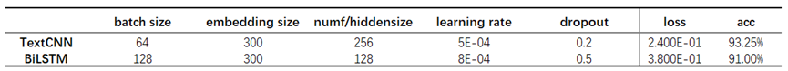
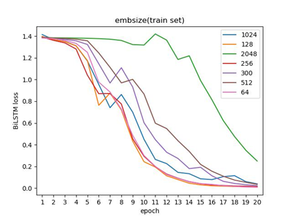

# **LAB2 Report**

### **@ Hepecho**

### 实验目的

- 了解神经网络中的基础模型

神经网络是指一系列受生物学和神经科学启发的数学模型。主要是通过对人脑的神经元网络进行抽象，构建人工神经元，并按照一定拓扑结构来建立神经元之间的连接。前馈神经网络（FNN）是最早发明的简单人工神经网络；卷积神经网络（CNN）是一种具有局部连接、权重共享等特性的深层前馈神经网络；循环神经网络（RNN）是一类具有短期记忆能力的神经网络。

- 了解深度学习框架Pytorch的使用

PyTorch使用python作为开发语言，近年来和TensorFlow, keras, caffe等热门框架一起，成为深度学习开发的主流平台之一。PyTorch的基本元素包含张量(Tensor)、变量(Variable)、神经网络模块(nn.Module)等。

- 了解使用深度学习解决文本分类任务基本流程

以PyTorch为例，一个常规的文本分类任务代码开发流程是：安装并导入相关的深度学习库、数据获取和预处理、定义神经网络、定义损失函数(loss function)和优化器(optimizer)、训练网络和测试网络。

### 实验环境

python 3.10 + jieba 0.42.1 + PyTorch 1.10.2 + NumPy 1.23.3 + Sklearn 1.1.2 + TensorboardX 2.2 + tqdm 4.64.1

### 实验步骤

1. 阅读代码，运行并得到结果。

2. 根据已有的TextCNN模型格式，写出BiLSTM模型，代码实现可参考[Chinese-Text-Classification-Pytorch](https://github.com/649453932/Chinese-Text-Classification-Pytorch)。TexcCNN模型相关超参数配置在\Chinese-Text-Classification-Pytorch \models\TextCNN.py

3. 调整batch size参数，取值分别为[8, 16, 32, 64]，画出TextCNN和BiLSTM训练集和验证集的loss折线图。

4. 调整embedding size参数，取值分别为[64, 128, 256]，画出TextCNN和BiLSTM训练集和验证集的loss折线图。

5. 调整hidden size参数，取值分别为[64, 128, 256]，画出TextCNN和BiLSTM训练集和验证集的loss折线图。

6. 调整learning rate参数，取值分别为[1e-2, 5e-3, 1e-3, 5e-4, 1e-4]，画出TextCNN和

BiLSTM训练集和验证集的loss折线图。

7. 调整dropout参数，取值分别为[0.1, 0.2, 0.3, 0.4, 0.5]，画出TextCNN和BiLSTM训练集和验证集的loss折线图。

8. 选出最好的参数组合（不局限于以上参数组合），列出参数并将实验结果写入表格进行对比分析，例如：

| 模型 | 准确率 |
| --- | --- |
| TextCNN | 86.80% |
| BiLSTM | 87.68% |

my:

loss图示例：

### 参考资料

1. [pytorch1.0.0官方文档](https://pytorch.org/docs/1.0.0/)

2. [《神经网络与深度学习》](https://nndl.github.io/)

3. [Convolutional Neural Networks for Sentence Classification](https://arxiv.org/abs/1408.5882)

4. [Chinese-Text-Classification-Pytorch](https://github.com/649453932/Chinese-Text-Classification-Pytorch)